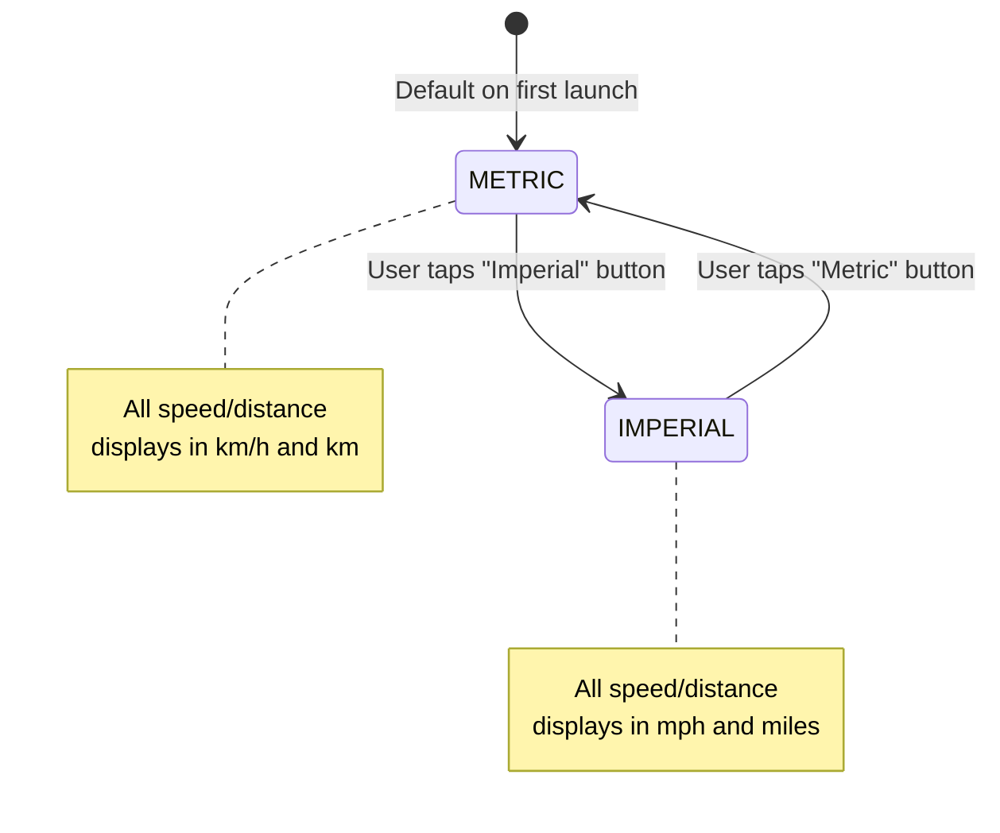
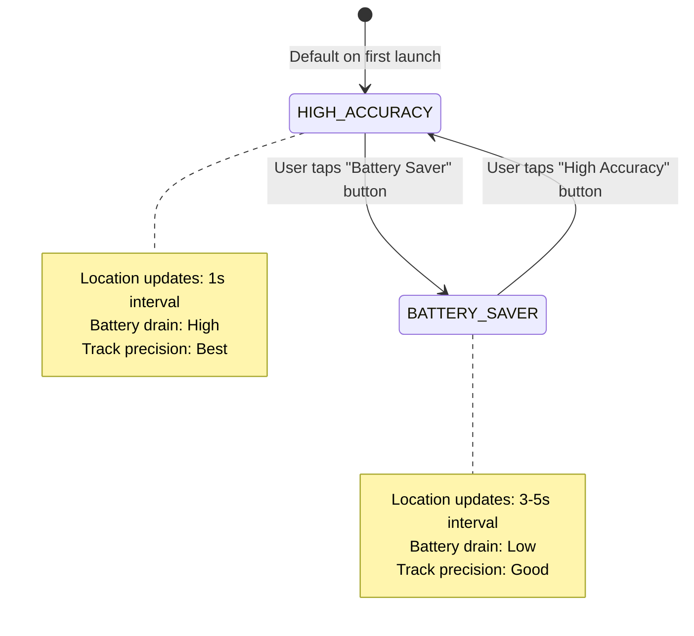
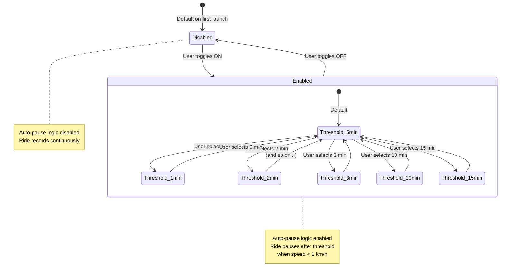

# Data Model: Basic Settings Infrastructure

**Feature**: 001-settings-infrastructure
**Phase**: 1 (Design & Contracts)
**Date**: 2025-11-04

## Overview

This document defines the data entities, validation rules, state transitions, and storage schema for the Basic Settings Infrastructure feature. All models follow Clean Architecture principles with no Android framework dependencies in the domain layer.

---

## Domain Models

### 1. UnitsSystem (Enum)

**Purpose**: Represents user's preferred measurement system for speed and distance display.

**Definition**:
```kotlin
enum class UnitsSystem {
    METRIC,    // km/h, km
    IMPERIAL   // mph, miles
}
```

**Attributes**:
- `METRIC`: Kilometers per hour (km/h) and kilometers (km)
- `IMPERIAL`: Miles per hour (mph) and miles (mi)

**Validation Rules**:
- Must be one of two values (enforced by enum)
- No null allowed (non-nullable enum)

**Default Value**: `METRIC`

**Used By**:
- SpeedTrackingViewModel (current speed display)
- RideTrackingViewModel (live ride statistics) - Feature 1A
- RideHistoryViewModel (historical ride distances) - Feature 3
- RideReviewViewModel (ride detail statistics) - Feature 1A

**Storage Mapping**:
- DataStore key: `units_system` (String)
- Persisted values: `"metric"` | `"imperial"`

---

### 2. GpsAccuracy (Enum)

**Purpose**: Represents user's preferred GPS update frequency, balancing accuracy vs battery life.

**Definition**:
```kotlin
enum class GpsAccuracy {
    BATTERY_SAVER,  // 3-5 second intervals
    HIGH_ACCURACY   // 1 second intervals
}
```

**Attributes**:
- `BATTERY_SAVER`: Location updates every 3-5 seconds (lower battery drain)
- `HIGH_ACCURACY`: Location updates every 1 second (higher battery drain, more precise tracking)

**Validation Rules**:
- Must be one of two values (enforced by enum)
- No null allowed (non-nullable enum)

**Default Value**: `HIGH_ACCURACY`

**Behavior Mapping**:
| Setting | Update Interval | Battery Impact | Use Case |
|---------|-----------------|----------------|----------|
| `HIGH_ACCURACY` | 1000ms | High | Default, most users, best precision |
| `BATTERY_SAVER` | 3000-5000ms | Low | Delivery riders on long shifts |

**Used By**:
- LocationRepository (configures FusedLocationProviderClient update interval)
- SpeedTrackingViewModel (affects speed update frequency)
- RideTrackingViewModel (affects track point density) - Feature 1A

**Storage Mapping**:
- DataStore key: `gps_accuracy` (String)
- Persisted values: `"battery_saver"` | `"high_accuracy"`

---

### 3. AutoPauseConfig (Data Class)

**Purpose**: Represents user's auto-pause configuration for ride recording.

**Definition**:
```kotlin
data class AutoPauseConfig(
    val enabled: Boolean,
    val thresholdMinutes: Int
) {
    companion object {
        fun default() = AutoPauseConfig(
            enabled = false,
            thresholdMinutes = 5
        )

        val validThresholds = listOf(1, 2, 3, 5, 10, 15)
    }

    init {
        require(thresholdMinutes in validThresholds) {
            "thresholdMinutes must be one of: ${validThresholds.joinToString()}"
        }
    }
}
```

**Attributes**:
- `enabled` (Boolean): Whether auto-pause is active
  - `true`: Ride will auto-pause when stationary
  - `false`: Ride continues recording regardless of speed
- `thresholdMinutes` (Int): Duration (in minutes) rider must be stationary before auto-pause triggers
  - Range: 1-15 minutes
  - Valid values: 1, 2, 3, 5, 10, 15 (discrete options only)

**Validation Rules**:
- `enabled`: Boolean, always valid
- `thresholdMinutes`:
  - Must be one of: 1, 2, 3, 5, 10, 15
  - Enforced by `init` block with `require()`
  - Invalid values throw `IllegalArgumentException`

**Default Values**:
- `enabled`: `false` (opt-in feature)
- `thresholdMinutes`: `5` (balanced default)

**Stationary Detection Logic**:
- Speed threshold: < 1 km/h (hardcoded in TrackLocationUseCase)
- Duration threshold: Configurable via `thresholdMinutes`
- Auto-pause triggers when: `speed < 1 km/h for thresholdMinutes`
- Auto-resume triggers when: `speed > 1 km/h` (immediate, no delay)

**Used By**:
- TrackLocationUseCase (auto-pause detection logic) - Feature 1A
- RideTrackingViewModel (displays "⏸️ Paused" indicator) - Feature 1A

**Storage Mapping**:
- DataStore keys:
  - `auto_pause_enabled` (Boolean)
  - `auto_pause_minutes` (Int)
- Persisted separately for easier querying

---

## Repository Interface

### SettingsRepository

**Purpose**: Abstract interface for settings persistence, allows for DataStore implementation swap without affecting domain/UI layers.

**Definition**:
```kotlin
interface SettingsRepository {
    // Reactive reads (Flow for automatic UI updates)
    val unitsSystem: Flow<UnitsSystem>
    val gpsAccuracy: Flow<GpsAccuracy>
    val autoPauseConfig: Flow<AutoPauseConfig>

    // Writes (suspend functions for async DataStore operations)
    suspend fun setUnitsSystem(units: UnitsSystem)
    suspend fun setGpsAccuracy(accuracy: GpsAccuracy)
    suspend fun setAutoPauseConfig(config: AutoPauseConfig)
}
```

**Reactive Reads**:
- All reads return `Flow` for reactive UI updates
- UI collects with `collectAsStateWithLifecycle()` to observe changes
- Flows emit initial value immediately (from DataStore or default)
- Flows emit new values whenever DataStore changes

**Async Writes**:
- All writes are `suspend` functions (require coroutine scope)
- Changes persist immediately to DataStore
- No return value (fire-and-forget)
- Errors logged but not thrown (graceful degradation)

**Error Handling**:
- Read failures: Emit default value (caught in `Flow.catch`)
- Write failures: Log error, continue execution (try-catch in implementation)
- No user-facing error messages (settings always functional)

---

## DataStore Schema

### Preferences Keys

**DataStore File**: `user_settings` (default DataStore Preferences name)

**Key Definitions**:
```kotlin
object PreferencesKeys {
    val UNITS_SYSTEM = stringPreferencesKey("units_system")
    val GPS_ACCURACY = stringPreferencesKey("gps_accuracy")
    val AUTO_PAUSE_ENABLED = booleanPreferencesKey("auto_pause_enabled")
    val AUTO_PAUSE_MINUTES = intPreferencesKey("auto_pause_minutes")
}
```

**Schema Table**:

| Key | Type | Allowed Values | Default | Validation |
|-----|------|----------------|---------|------------|
| `units_system` | String | `"metric"`, `"imperial"` | `"metric"` | Enum mapping |
| `gps_accuracy` | String | `"battery_saver"`, `"high_accuracy"` | `"high_accuracy"` | Enum mapping |
| `auto_pause_enabled` | Boolean | `true`, `false` | `false` | Native boolean |
| `auto_pause_minutes` | Int | `1`, `2`, `3`, `5`, `10`, `15` | `5` | Range check in domain model |

**Storage Format**:
- DataStore Preferences (Protocol Buffers internally)
- Human-readable keys for debugging
- Type-safe keys via Kotlin delegates
- Atomic writes (all-or-nothing transactions)

**Data Location**:
- File path: `/data/data/com.example.bikeredlights/files/datastore/user_settings.preferences_pb`
- Device-local only (no cloud sync)
- Persists across app updates (shared preferences migration not needed)
- Survives app data clear only if backed up (Android Auto Backup)

---

## State Transitions

### Units System



**Transition Rules**:
- Initial state: `METRIC` (default)
- User-initiated only (no automatic switching based on location)
- Immediate effect (no confirmation dialog)
- Persists immediately to DataStore on change
- Change reflected across all screens within 1 second

---

### GPS Accuracy



**Transition Rules**:
- Initial state: `HIGH_ACCURACY` (default)
- User-initiated only
- Immediate effect (no confirmation dialog)
- Persists immediately to DataStore on change
- LocationRepository update interval changes on next location request
- Active rides continue with old interval until next ride start (no mid-ride disruption)

---

### Auto-Pause Configuration



**Transition Rules**:
- Initial state: `Disabled` with `5 minutes` threshold (default)
- User-initiated only
- Threshold can be changed while toggle is OFF (saved but not applied)
- Enabling applies threshold immediately to active rides
- Disabling stops auto-pause logic immediately (if ride is paused, it remains paused until user resumes)
- Persists immediately to DataStore on change

---

## Validation Rules Summary

### Input Validation

**UnitsSystem**:
- ✅ Valid: `METRIC`, `IMPERIAL` (enum values)
- ❌ Invalid: Any other string, null, empty

**GpsAccuracy**:
- ✅ Valid: `BATTERY_SAVER`, `HIGH_ACCURACY` (enum values)
- ❌ Invalid: Any other string, null, empty

**AutoPauseConfig**:
- `enabled`:
  - ✅ Valid: `true`, `false` (boolean values)
  - ❌ Invalid: null
- `thresholdMinutes`:
  - ✅ Valid: `1`, `2`, `3`, `5`, `10`, `15` (discrete integers)
  - ❌ Invalid: `0`, `4`, `6`, `7`, `8`, `9`, `11`, `12`, `13`, `14`, `16+`, negative, null
  - Enforced by: `init` block with `require()` check

### DataStore Validation

**On Read**:
- Unknown string values → map to default enum value (graceful fallback)
- Missing keys → emit default value
- Corrupted file → emit default values

**On Write**:
- Enum values → converted to lowercase strings before persisting
- Boolean/Int values → persisted directly (type-safe)
- Write failures → logged but not rethrown

---

## Migration Strategy

**v0.2.0 (Initial Release)**:
- No migration needed (first release of settings)
- Default values used on first launch

**Future Migrations** (for reference):
- v0.X.0 → v0.Y.0: If DataStore keys renamed, implement `DataMigration<Preferences>`
- Add new keys: Simply add to `PreferencesKeys` object, defaults auto-applied
- Remove keys: No action needed, old keys ignored
- Change types: Requires migration to read old key, write new key, delete old key

**Example Future Migration**:
```kotlin
object SettingsMigration : DataMigration<Preferences> {
    override suspend fun shouldMigrate(currentData: Preferences): Boolean {
        return currentData.contains(OLD_KEY) && !currentData.contains(NEW_KEY)
    }

    override suspend fun migrate(currentData: Preferences): Preferences {
        return currentData.toMutablePreferences().apply {
            val oldValue = this[OLD_KEY]
            this[NEW_KEY] = transformValue(oldValue)
            this.remove(OLD_KEY)
        }
    }

    override suspend fun cleanUp() {
        // No-op for settings (no external cleanup needed)
    }
}
```

---

## Performance Considerations

**Read Performance**:
- DataStore reads are fast (< 1ms for small datasets)
- Flows cached in ViewModel (single source of truth)
- UI only collects once per screen (no redundant reads)

**Write Performance**:
- DataStore writes are async (< 10ms for small datasets)
- No UI blocking (suspend functions in coroutine scope)
- Writes batched automatically by DataStore (if multiple changes in quick succession)

**Memory Footprint**:
- 4 keys × ~50 bytes per value = ~200 bytes total
- Negligible impact on app memory

**Storage Footprint**:
- Protocol Buffers file: < 1 KB
- Negligible impact on device storage

---

## Testing Strategy

### Unit Tests (Domain Models)

**UnitsSystem**:
- ✅ Enum values are exactly METRIC and IMPERIAL
- ✅ No null values allowed
- ✅ Enum can be used in when statements exhaustively

**GpsAccuracy**:
- ✅ Enum values are exactly BATTERY_SAVER and HIGH_ACCURACY
- ✅ No null values allowed

**AutoPauseConfig**:
- ✅ Valid thresholds (1, 2, 3, 5, 10, 15) create instances successfully
- ❌ Invalid thresholds (0, 4, 16, -1) throw IllegalArgumentException
- ✅ Default config is `enabled=false, thresholdMinutes=5`
- ✅ Companion validThresholds list matches actual valid values

**Example Test**:
```kotlin
@Test
fun `AutoPauseConfig throws on invalid threshold`() {
    assertThrows<IllegalArgumentException> {
        AutoPauseConfig(enabled = true, thresholdMinutes = 4)
    }
}
```

### Integration Tests (Repository + DataStore)

**SettingsRepository**:
- ✅ Default values emitted on first read (empty DataStore)
- ✅ Written values persisted and emitted on next read
- ✅ Read failures emit defaults (corrupt DataStore simulated)
- ✅ Write failures logged but don't crash app
- ✅ Multiple rapid writes handled gracefully (last write wins)

### UI Tests (End-to-End)

**Settings Persistence**:
- ✅ Change units to Imperial → restart app → Imperial still selected
- ✅ Change GPS accuracy to Battery Saver → restart app → Battery Saver still selected
- ✅ Enable auto-pause with 10 min threshold → restart app → enabled with 10 min
- ✅ Disable auto-pause → restart app → disabled

---

## Summary

**3 Domain Models**:
- `UnitsSystem` (enum): METRIC, IMPERIAL
- `GpsAccuracy` (enum): BATTERY_SAVER, HIGH_ACCURACY
- `AutoPauseConfig` (data class): enabled + thresholdMinutes

**4 DataStore Keys**:
- `units_system` (String)
- `gps_accuracy` (String)
- `auto_pause_enabled` (Boolean)
- `auto_pause_minutes` (Int)

**Validation**:
- Enum validation via type system
- Threshold validation via `init` block with `require()`
- Read failures → defaults
- Write failures → logged

**State Transitions**:
- User-initiated only (no automatic changes)
- Immediate persistence (no delay)
- Graceful error handling (no crashes)

**Ready for Phase 1 completion. Next: Generate contracts and quickstart guide.**
